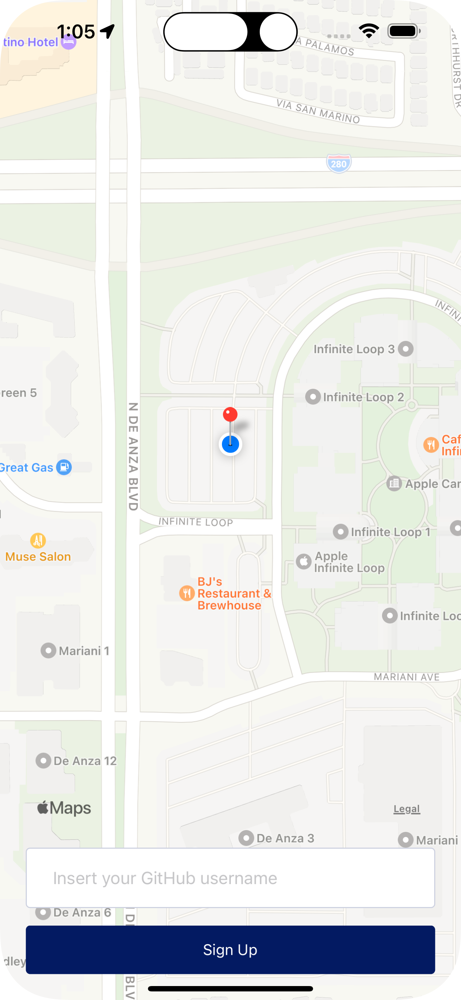
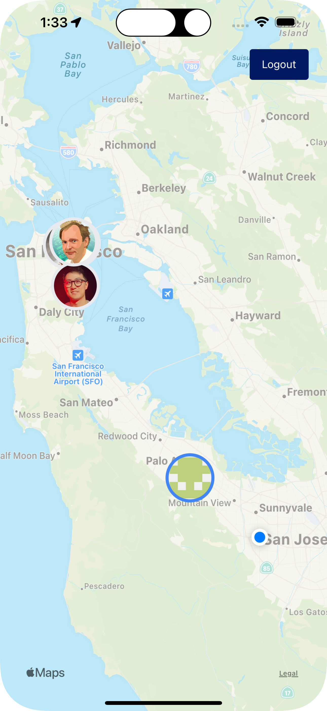
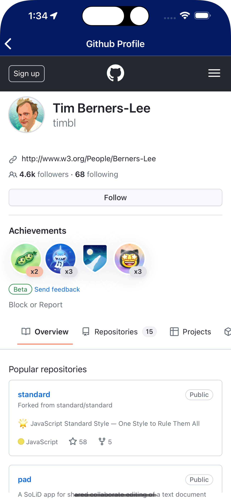

# Dev Finder App

**dev finder** is a mobile app that helps developers find peers in a geographic area, fostering new projects, knowledge sharing and professional growth.

<div align="center">
    
    
    
</div>

Because physical proximity between users is important for such collaboration, you are encouraged to fork this project for your own local area, add your own branding, maybe translate it, and make it part of your portfolio.

Do not forget to setup a backend service to connect your fork to, as instructed [below](#backend-setup).

## Installation

The app is not released in the app stores. If you want to run it, follow the [setup instructions for developers](#setup).

## Forking / Contributing

### Backend setup

#### Setting up the fake API (json-server)

Before running your 'json-server' update the file `src/services/api.ts` to include your computer's IP address. Change the baseURL to `http://your_ip_address_here:3333` and then run:

```
npx json-server --watch db.json --port 3333 --host your_ip_address_here
```

#### Acessing your database online (my-json-server)

To access your server online without running json-server locally, you can set your baseURL to:

```
https://my-json-server.typicode.com/<your-github-username>/<your-github-repo>
```

To use `my-json-server`, make sure your `db.json` file is located at the repository root.

**\*NOTE**: my-json-server have some limitations. For example, you'll not be able to add any data into the server db.\*

### Setup

-   Clone this repository
-   `npm i`
-   Start your own BE server (see [backend setup](#backend-setup))
-   `npm expo start`
-   Load app through Expo Go

### Running tests

-   `npm test`

## Support

Please see if your question or issue is already filed by searching in [current issues](https://github.com/bvc-mobile-dev/dev-finder/issues); if not, feel free to create a new one.
